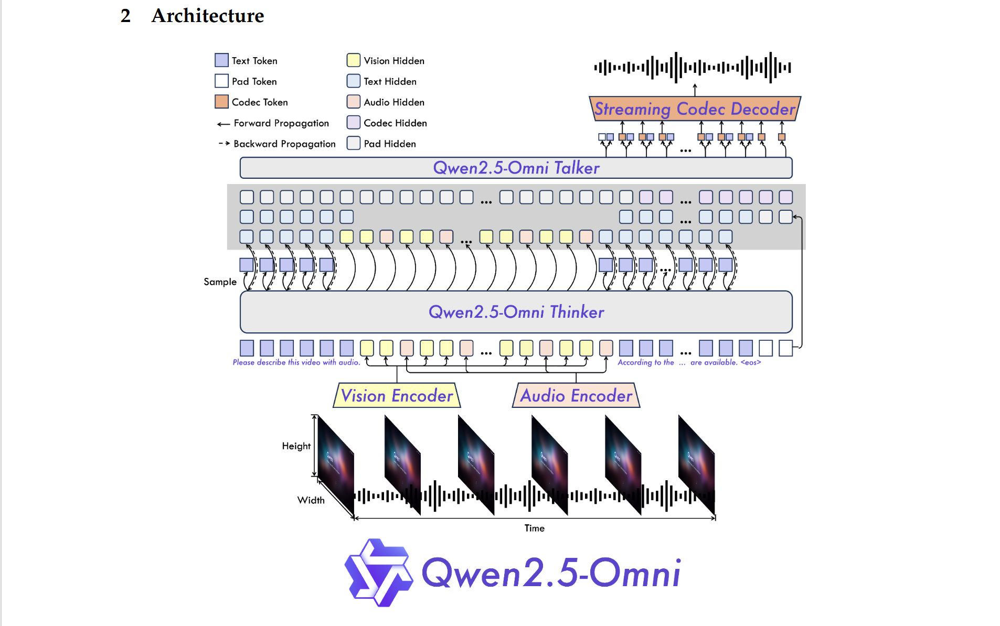
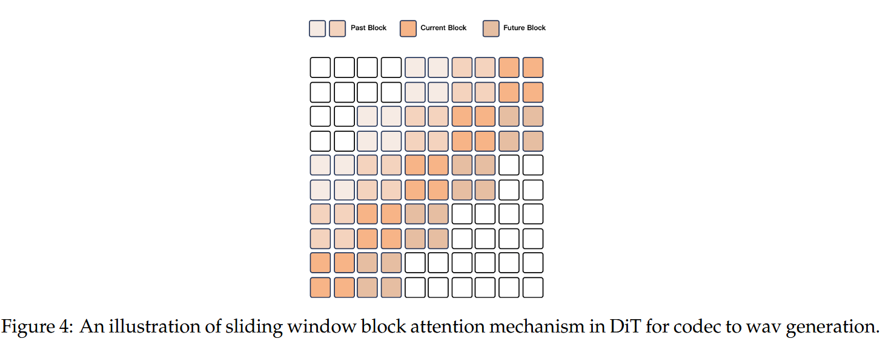

# Note : Qwen2.5-Omni Technical Report
> 由于本人较菜(qwq)以及刚接触 mllm ,会记录更多的基础知识,以引用方式区分论文部分与基础知识

## Introduction

### What is Qwen2.5-Omni ?
端到端多模态(text,image,audio,video)大模型,可同时流式产生 text 和 natural speech
> streaming manner ：模型一边生成内容，一边将结果逐步输出，与普通生成相对(non-straming)
> 
> end-to-end : 直接从输入到输出，中间所有步骤都由一个整体模型自动完成，无需手工干预(eg:特征工程)或中间处理步骤

### What challenges does Omni model face ?   
- 多种模态的联合训练 (尤其对于 video 需要 audio 和 visual 对齐)
- 控制不同种模态在训练时的相互干扰
- 减少 audio output streaming 延迟，通过探索模型架构 

### What innovations are Qwen2.5-Omin ?
- **T**ime-aligned **M**ultimodal **RoPE** **(TMRoPE)** position embedding
- **Thinker-Talker** architecture
- **block-wise processing** in audio and visual encoder
- **sliding-window** DiT decoding audio

## Architecture

### Thinker-Talker architecture
Thinker (brain) : 处理和理解多模态输入，生成高级表示和对应的文本   
  - a Transformer decoder  
  
Talker (mouth): 流式接受来自 Thinker 的输出并且输出 speech token
  - a dual-track autoregressive Transformer decoder

> **dual-track model**(双轨模型) : 模型在生成内容时**并行建模两个序列**(或模态/轨道)，这两个序列可能存在依赖或交互，从而提升整体建模能力
>

 
### Perceivation
**tokenize text** : Qwen's tokenizer  
  - 应用包含 151,643 regular token词汇表的**字节级 BPE 编码**
> **BPE (Byte-Pair Encoding)** : 一种字词分词算法，将词语分为更小的单位，用频率更高的字串合并来减少词表大小，同时覆盖未登录词(unknown words)  
> **Byte-level BPE** : 用**字节**而不是**字符**来进行 BPE 操作

**audio input & audio from video** : Qwen2-Audio encoder
  - 先重采样至 16kHZ 的频率，再将原始波形转换为具有 128 通道的 Mel频谱图，所使用窗口大小为 25ms，跳帧(步长)为 10ms
  - 再用 Qwen2-Audio 使得每帧表示大致对应于原 40ms audio signal 
> **采样率 (sampling rate)** : 单位时间内从连续音频信号中采集样本的次数，通常单位为 赫兹 HZ 或 kHZ(千赫) eg : 16kHZ 采样率指每秒采集16,000个样本点
>  
> **原始音频波形 (raw waveform)** : 采样后得到的一维时间序列，是一长串浮点数/整数，每个值表示声波再某一时间点的振幅大小
> 
> **Mel 频谱图 (Mel-Spectrogram)** : 将音频波形转化为" 时间 * 频率形式的二维图像 "，其中频率轴式按人耳听觉感知方式(Mel标度)非线性划分的
> 
> **window** : 窗口大小(window size)为每次分析的时间长度, 步长(hop size)为每次窗口移动的时间长度 

**vision encoder** : Qwen2.5-VL
  - 基于 ViT , 大约有 67.5亿参数，可同时处理 image 和 video
  - 采用融合图像与视频数据的混合训练方案，以增强理解
  - 采用动态帧率对视频采样同时对齐音频采样
  - 将每张图片当作两帧完全相同的帧来处理

> 动态帧率 (dynamic frame rate) : 在对视频进行帧抽样时，所用帧率不是固定，而是根据默写外部因素动态调整每秒取多少帧

**Video & TMRoPE** :  
 
**TMRoPE** :  将原始旋转编码结构为三部分 : temporal, height, width
  - 当含有多个模态，position 编号通过将前一个模态最大位置 ID 递增 1 来初始化
  - for text : identical position IDS, 等价于 1D-RoPE
  - for audio : identical position IDs, 绝对时间位置编码，一个时间 ID 对应 40ms
  - for image : identical temporal IDs, 根据图像块位置分配 height 和 width
  - for video with audio :
    - audio : identical position IDs 每帧 40ms内，每帧增加 1，
    - video : 看作图像序列，每一帧对应一个 Temporal ,向后递增，height、width 与 image 相同
    - 由于视频中帧率不固定，根据实际时间动态调整使得每一个 Temporal ID 对应 40ms

> **RoPE (Rotary Position Embedding)** : 一种相对位置编码方式，旋转编码，相对位置建模，无需引入额外参数
> 
> **M-RoPE(Multimodal RoPE)** : 一种用于多模态输入位置编码的方法，通过调整 RoPE，使不同模态可以共享或对齐空间/时间位置的信息，更好地实现模态融合与交互

time-interleaving algorithm for audion and video  
  - 使模型同时接收视觉和听觉信息
  - 按照实际时间每 2 秒将视频和音频表示划分为一个片段，在每个 2 秒片段中，将视频表示放在前面，音频表示放在后面，实现"视频 + 音频"的交错排列
 
### Generation
**Text** :   
- Text 直接由 Thinker 产生
- 根据词汇表的概率分布利用自回归采样生成，包含重复惩罚和 top-p 采样以增强多样性
> repetition penalty （重复惩罚） : 通过降低已出现 token 的概率来鼓励多样性，防止语言模型'机械复读'
> 
> top-p sample （nucleus sample）: 一种根据概率分布动态（截断概率）选取一小部分最有可能 token 的采样方法，用于在生成质量与多样之间做平衡

**Speech** :  
- 接受 Thinker 的 high-level representation 和 text tokens
- 高级特征有助于预测内容的语气和态度 （因为是流式算法，必须在整个文本生成前预测）
- 高级表征主要表达语义相似性而不是语音相似性，采样的离散 token 有助于消除语音不同但语义相似的不确定性

qwen-tts-tokenizer : 一个语音编解码器，解码器流式自回归生成，且语音的生成不需要文本的逐词对齐或时间戳级别的对齐，大大简化了训练数据的要求和推理过程的复杂度。
  
### design for streaming
**challenge** ： 
**initial packet latency （初始分组延迟）**：从用户发出第一个输入开始，到系统输出第一段语音或响应音频 token 之间所消耗的时间

影响因素 :   
- 处理多模态输入造成的延迟
- 首响应时间(first token latency) : 从接受到第一个文本输入到生成第一个语音 token 之间的延迟
- 将第一个语音片段(speech segment)转成真实音频的延迟
- 模型架构本身的固有的计算延迟

解决方式 :  
- support prefilling : 修改 audio 和 visual 编码器去支持沿时间维度的模态交互中的块填充。具体来讲，audio 编码器只对 2s 内执行注意力，visual 编码器使用 flash attention ，并使用 MLP 层将相邻的 2*2 图像 token 合并为一个 token 进行空间降采样和特征融合。同时图像的 patch_size 设为 14 * 14
  
- streaming codec（解码器） generation  ：使用滑动窗口块状注意力机制，限制当前 token 只能访问有限上下文（访问四个区块，两个回溯，一个前瞻）。具体来说，使用由 Flow-Matching 方法构建的 DiT 模型，使用 Flow-Matching 将输入转换为 Mel 频谱图，再用修改后的 BigVGAN 重建波形。  

 
> chunked-prefill : 一种语言模型推理加速策略，把 prefill 阶段的长上下文，分成多个小块（chunk）逐步处理，而不是一次性全送入模型
> 
> flash attention : 一种高效的注意力计算算法
> 
> DiT model : 即 Diffusion Transformer，一种结合扩散模型和 Transformer 的生成架构
>
> Flow-Matching : 一种用于训练扩散模型的方式，不再依赖传统的 score matching 或 denoising objective，而是直接学习 “数据流动方向”的匹配
>
> BigVGAN : 一种高质量的语音合成器(vocoder)模型，可以将 mel 频谱图还原成可播放的音频波形（即 .wav 形式）

## Pre-training
Qwen2.5-Omni consists of three training stages  
1. 冻结 LLM 参数，训练视觉编码器和音频编码器
   - LLM 使用 Qwen2.5 初始化, vision encoder 使用 Qwen2.5-VL 初始化 , audio encoder 使用 Whisper-large-v3 初始化
   - vision encoder 和 audio encoder 在固定的 LLM 上分别训练
2. 解冻所有参数，在大规模多模态数据上训练以获得全面理解
   - 限制 maximum token length 为 8192 以提高训练效率
3. 使用 32k 长度的数据训练以增强长序列数据理解
   - 将 maximum token length 扩展到 32768 进行训练  
  
## Post-training
### Thinker
- 使用 ChatML 格式的 instruction-following data 进行指令微调
- 数据集包含 : 纯基于文本的对话数据，视觉模态对话数据，音频模态对话数据，混合模态对话数据

> **post-traing** : 指模型在完成预训练后，为更好地适应特定任务、特定场景，进行的进一步微调对齐或优化的阶段。
>   > 指令微调 (SFT) ：学会根据指令完成任务。   
>   > 人类反馈强化学习(RLHF) : 让模型输出更符合人类偏好。
>   
> **ChatML** : 一种多轮对话的输入格式标准，用结构化标记表示每个说话者的发言，使模型更好地理解上下文、角色与对话逻辑。

### Talker     
Talker consists three-stages training process    
1. train Talker to learn context continuation
   - 利用类似 Thinker 的文本监督和**自回归**语音延续任务学习上下文各种属性(eg:韵律、情感、口音等)
   - 实施音色解缠技术以防止模型将特定声部与不常见的文本模式相关联
2. 使用 DPO 增强对话生成稳定性并解决模型幻觉
3. 进行 speaker fine-tuning ，使得能采用特定声音并提高自然都
   
> **DPO(direct preference optimization)** : 即直接偏好优化，一种对比式偏好学习算法，目标是让语言模型输出更加符合人类偏好，而不需要用强化学习（如 PPO） 。
>   > 核心思想 ：每条数据包含一个 prompt、chosen（更好回复）、rejected（更差回复），比较 chosen 和 rejected 的概率，让没模型更倾向生成更受欢迎的回答。
>
> **timbre disentanglement** : 将音色从其他因素（如音高、节奏等）中分离出来，各自用独立的表示编码

## Evaluation
整体来讲，在下述两个方面都优于现有 Omni 模型，但针对专一领域最佳模型存在些小差距。

### understanding (X -> Text)

### speech generation (X -> Speech)

## todo list
- [Mini-Omni][1]
- [Qwen2-Audio][2]
- [Qwen2.5-VL (M-RoPE)][3]
- [Qwen2.5][4]

[3]:https://github.com/yuan-qi5/mllm/blob/main/paper/Qwen2.5-VL.md 
[4]:https://github.com/yuan-qi5/mllm/blob/main/paper/Qwen2.5.md
  
