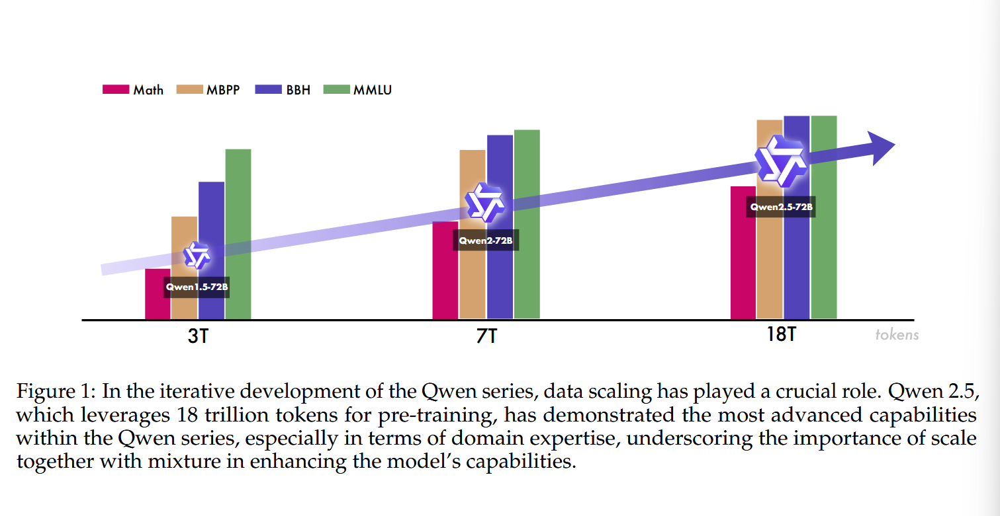

# Note :  Qwen2.5 Technical Report

## Induction 

Qwen2.5 有 7 个不同版本 ：0.5B，1.5B，3B，7B，14B，32B，72B，不仅提供 bfloat16 精度的原始模型，还提供不同精度的量化模型。

### What improvements are Qwen2.5 ?

- [pre-training stages][1] : 数据集规模从 7 万亿 tokens 到 18 万亿 tokens 

- [post-training stages][2] : 超过 1 百万样本进行监督微调和多阶段强化学习（包括离线学习 DPO 和在线学习 GRPO）

[1]:https://github.com/yuan-qi5/mllm/blob/main/paper/Qwen2.5.md#pre-training
[2]:https://github.com/yuan-qi5/mllm/blob/main/paper/Qwen2.5.md#post-training

### What key features of Qwen2.5 ?

- 更多样化尺寸

- 更多训练数据

- 更好使用 ：生成长度从 2K tokens 到 8K tokens，更好的支持结构化输入和输出（如表格和 JSON ）

> quantized（量化）: 一种压缩和加速模型推理的技术，将模型中连续的、精度较高的浮点数（如 FP32）转换为低精度表示（如 INT8、INT4 等），从而减少存储空间与计算负担
>
> proprietary model（专有模型）：指非开源模型。
>
> mixture-of-experts（MoE，专家混合模型）：一种深度学习模型架构，用于解决模型的能力平静问题。核心思想是将单个大模型分解为多个更小、更专业的 “专家”，每个专家只负责处理特定的子任务或特定的输入数据类型。
>
> MMLU(Massive Multi-task Language Understanding) ：测评多任务语言理解能力 + 专业知识广度
>
> BBH(big-Bench Hard) ：从 Big-Bench （谷歌提出的大型语言模型评测平台）中选出的 hard 子集，评测模型的复杂推理 + “边缘、冷门、未见任务”泛化能力 + 类人智能灵活性
>
> MBPP(Mostly Basic Python Programming) ：测评 Python 编程能力
> 

强调了数据规模的作用。

## Architecture & Tokenizer

for dense model ；

- 保持 Transformer-based decoder architecture，整合 Grouped Query Attention (GQA)有效地使用 KV cache 、 SwiGLU 激活函数进行非线性激活、旋转位置编码 (ROPE)编码位置信息、注意力机制中 QKV bias 和 RMSNorm 确保稳定训练

base on dense model, extend to MoE architecture :

- 将 FFN layers 换成 MoE layers，每层包含多个 FFN 专家和一个 routing mechanism 将 token 分给 top-k expert

- 使用了 shared expert routing 和 fine-grained expert segmentation

> dense model（稠密模型）：相对于稀疏模型（sparse model，如 MoE 模型）而言，每个输入会使用完整的参数集进行处理
>
> shared experts routing（共享专家路由）：多个任务或多个领域之间共享一批专家网络，而不是为每个任务专门设置一批专家
>
> fine-grained expert segmentation（细粒度专家分割）：通过更精细化策略，将专家的功能或关注点细致划分，是使得个专家更加专注于具体的特征或子任务

for tokenization :

- 使用 Qwen's tokenizer ，包含 151,643 regular token词汇表的**字节级 BPE 编码**，将 control tokens 从 3 扩展到 22 ，

> **BPE (Byte-Pair Encoding)** : 一种字词分词算法，将词语分为更小的单位，用频率更高的字串合并来减少词表大小，同时覆盖未登录词(unknown words)
> 
> **Byte-level BPE** : 用**字节**而不是**字符**来进行 BPE 操作

## Pre-training

consists of three processes :

- data preparation : 通过复杂的过滤和评分机制，再结合数据混合，构建高质量数据

- hyperparameters selection : 对超参数进行研究以有效的训练那各种规模的模型

- long-context training : 采用长上下文预训练，增强模型对长序列处理和理解能力

### pre-training data 

- better data filtering ：使用 Qwen2-Instruct 模型作为数据质量过滤器，执行全面的多为分析，以评估和评分悬链样本

- better math and code data ：整合了来自 Qwen2.5-Math 和 Qwem2,5-Coder 里的数据

- better synthetic data : 使用 Qwen2-72B-Instruct 和 Qwen2-Math-72B-Instruct 生成，再用 内部通用奖励模型和 Qwen2-Math-RM-72B 筛选

- bet mixture : 使用 Qwen2-Instruct 模型对不同领域内容进行分类和平衡，减少出现过多的领域的数据，增加高质量有价值领域的数据

  
### scaling law for hyper-parameters

先前研究主要使用 scaling laws 去再给定计算开销下确定最佳 **model size**，这里使用 scaling laws 去研究在给定预训练数据下确定最佳**training parameters**（如批量大小和学习率对于不同尺寸的 dense 模型和  MoE）

即 batch_size ,lr 如何随 model_size 和 pre-training_data_size 变化 

### long-context pre-training

分为两阶段，初始阶段上下文长度为 4096 tokens，随后扩展至 32,768 tokens，RoPE base frequency 为 10,000（Qwen2.5-Turbo 除外）

对 Qwen2.5-Turbo，实施递进策略，分为四个阶段 : 32,768 tokens, 65,536 tokens, 131,072 tokens, 262,144 tokens。RoPE 基础频率使用1,000,000 通过 ABF 技术。同时在每个阶段仍包括为当前长度 40%、60% 的较短序列。

为增强推理时长序列处理能力，实施了 YARN 和 Dual Chunk Attention(DCA) 策略，使得 Qwen2.5-Turbo 处理 tokens 数量达到 1百万，其他模型可处理 131，272 tokens 

## Post-training 

## Evaluation

